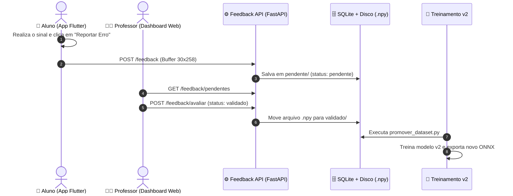

# 👁️ Sinaliza Vision Backend & On-Device AI

> **Módulo Central de Visão Computacional, Inteligência Artificial e Aprendizado Contínuo para o Sinaliza App (Libras Gamificado)**  
> *Disciplina: PIEC 3 — 1ª Avaliação (1ª VA)*

---

## 🌟 Visão Geral

O **Sinaliza Vision** é o ecossistema de Visão Computacional do **Sinaliza App**, desenvolvido para traduzir gestos da Língua Brasileira de Sinais (Libras) em tempo real.

A arquitetura foi **unificada e migrada 100% para Keypoints (MediaPipe + PyTorch/ONNX)**, eliminando modelos pesados de detecção de imagem (YOLO). Com isso, alcançamos:
* **Invariância Geométrica:** Reconhecimento preciso com o usuário próximo ou afastado da câmera.
* **Inferência On-Device:** Modelos leves em formato universal **ONNX** rodando no celular (Flutter) e navegador (Web) em **$\sim 4\text{ ms}$** (sem depender de servidor).
* **Aprendizado Contínuo (*Continuous Learning*):** Alunos reportam erros no app, professores moderam no Dashboard Web e novos datasets (`v2`, `v3`) são promovidos automaticamente para retreino.

📄 **Consulte o relatório completo:** [`RELATORIO_ENTREGA_1VA.md`](./RELATORIO_ENTREGA_1VA.md)  
📋 **Acompanhe o backlog das sprints:** [`planejamento_sprints.md`](./planejamento_sprints.md)

---

## 🧠 Modelos de IA e Acurácia

| Modelo | Finalidade | Arquitetura | Classes | Tamanho ONNX | Acurácia |
| :--- | :--- | :--- | :--- | :--- | :--- |
| **`modelo_mlp_alfabeto.onnx`** | Alfabeto Estático | MLP Densa (3 camadas) | 27 ($A$ a $Z$ + $Ç$) | **$169\text{ KB}$** | **$> 95\%$** |
| **`modelo_lstm_libras.onnx`** | Expressões Dinâmicas | 2x LSTM + Fully-Connected | 31 Palavras / 30 frames | **$1.37\text{ MB}$** | **$98.92\%$** *(Validação)* / **$93.01\%$** *(Global)* |

---

## 🔄 Fluxo de Aprendizado Contínuo



---

## 📂 Estrutura do Repositório

```
sinaliza_vision_backend/
├── dataset/
│   ├── treinamento/
│   │   └── v1/                      # Dataset versionado com 58 classes (27 letras + 31 expressões)
│   └── feedback/
│       └── bruto/                   # Amostras recebidas dos alunos (pendente / validado)
├── src/
│   └── feedback_loop/
│       ├── database.py              # Banco SQLite de amostras (sinaliza_feedback.db)
│       ├── feedback_api.py          # API REST FastAPI para Alunos e Professores
│       ├── curator.py               # Utilitário CLI de curadoria
│       └── promover_dataset.py      # Script de promoção imutável para v2, v3...
├── cv_utils.py                      # Extração de 258 keypoints e normalização geométrica
├── coletar_dados.py                 # Coletor interativo com webcam
├── treinar_alfabeto.py              # Treinamento da MLP em PyTorch
├── treinar_lstm.py                  # Treinamento da LSTM em PyTorch
├── exportar_onnx.py                 # Conversor PyTorch -> ONNX Universal com validação
├── testar_alfabeto.py               # Teste do Alfabeto em tempo real via Webcam
├── testar_lstm.py                   # Teste de Expressões Dinâmicas em tempo real via Webcam
├── sinaliza_app_libras/             # Repositório Flutter (branch feature/ia-onnx-services)
└── sinaliza_web_dashboard/          # Dashboard Web React (branch feature/laboratorio-e-curadoria-ia)
```

---

## 🚀 Como Executar

### 1. Configurar o Ambiente Virtual Python
```powershell
python -m venv .venv
.venv\Scripts\activate
pip install -r requirements.txt
pip install onnx onnxruntime onnxscript uvicorn fastapi
```

### 2. Iniciar a API de Feedback (FastAPI)
```powershell
.venv\Scripts\python.exe -m uvicorn src.feedback_loop.feedback_api:app --reload --port 8000
```
* Acesse a documentação interativa Swagger em: `http://localhost:8000/docs`

### 3. Testar a IA com a Webcam (Python)
```powershell
# Testar Expressões Dinâmicas (Palavras):
.venv\Scripts\python.exe testar_lstm.py

# Testar Alfabeto Estático (Letras A-Z):
.venv\Scripts\python.exe testar_alfabeto.py
```

### 4. Exportar Modelos para ONNX
```powershell
.venv\Scripts\python.exe exportar_onnx.py
```

### 5. Iniciar o Laboratório de IA no Dashboard Web
```powershell
cd sinaliza_web_dashboard
npm run dev
```
* Acesse `http://localhost:5173/dashboard/ai-lab` para o **Laboratório de Câmera ONNX Web**.
* Acesse `http://localhost:5173/dashboard/curator` para a **Central de Curadoria do Professor**.

---

## 👥 Equipe & Disciplina

* **Projeto:** Sinaliza App — Libras Gamificado
* **Disciplina:** PIEC 3 — 1ª Avaliação (1ª VA)
* **Licença:** MIT
