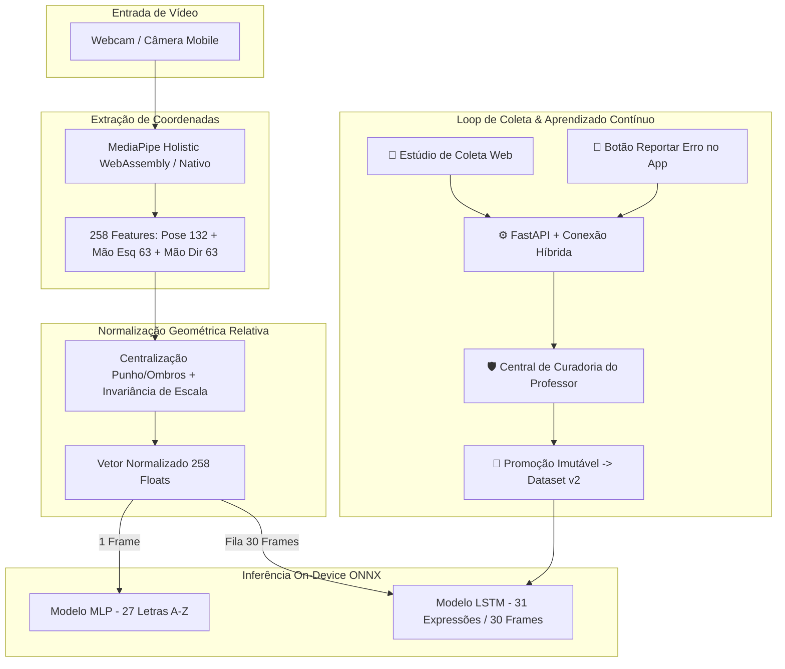

# 📋 Relatório de Entrega da 1ª Avaliação (1ª VA) - Sinaliza Vision
**Disciplina:** PIEC 3 — Projeto Integrado de Engenharia de Computação  
**Projeto:** Sinaliza App (Módulo de Visão Computacional, Estúdio Web e Aprendizado Contínuo)  
**Data:** 15 de Setembro de 2026  

---

## 🎯 1. Resumo Executivo & Objetivos da 1ª VA

O objetivo desta primeira etapa foi **reestruturar e modernizar a arquitetura de Visão Computacional do Sinaliza App**, garantindo que o reconhecimento de Libras seja rápido, confiável, invariante à distância do usuário, capaz de rodar diretamente nos navegadores/dispositivos móveis e estruturado com uma esteira completa de MLOps (Coleta Web, Curadoria e Aprendizado Contínuo).

### 🏆 Principais Conquistas Entregues:
1. **Unificação da Arquitetura em Keypoints (Eliminação do YOLO):** Substituição de modelos pesados de detecção de imagem por uma extração leve de coordenadas (MediaPipe Holistic) combinada com redes neurais especialistas (MLP e LSTM).
2. **Normalização Geométrica Invariante:** Centralização nos ombros e punhos com fator de escala relativo, permitindo reconhecer sinais com o usuário próximo ou distante da câmera.
3. **Treinamento de Alta Acurácia:**
   * **Alfabeto Estático (MLP):** 27 classes ($A$ a $Z$ + $Ç$) com acurácia $> 95\%$.
   * **Expressões Dinâmicas (LSTM):** 31 classes com **$98.92\%$ de acurácia de validação** e **$93.01\%$ de acurácia global** no dataset completo.
4. **Inferência On-Device com ONNX Universal:** Modelos exportados e validados numericamente ($\Delta < 10^{-4}$), permitindo inferência local no celular ou navegador em **$\sim 4\text{ ms}$** (sem depender de servidor).
5. **Novo Estúdio de Coleta Web (*Zero-Setup*):** Gravação assistida de sinais direto pelo navegador (Chrome/Edge) com MediaPipe WebAssembly a 60 FPS, eliminando a necessidade de instalar Python/OpenCV para alunos e voluntários.
6. **Sistema de Aprendizado Contínuo (*Continuous Learning*):** Fluxo ponta a ponta onde o aluno reporta erros no app ou grava na web, o professor modera no Dashboard Web (aprovar/corrigir/rejeitar) e o sistema gera novas versões do dataset (`v2`) de forma imutável com 1 clique.
7. **Integração Completa nos 3 Repositórios:** Backend Python (`sinaliza_vision_backend`), App Flutter (`sinaliza_app_libras`) e Portal Web (`sinaliza_web_dashboard`).

---

## 🏗️ 2. Arquitetura da Solução

### 📐 Matemática da Normalização Relativa:
* **Pose (Corpo):** Define o ponto médio dos ombros $(Landmark_{11} + Landmark_{12})/2$ como a origem $(0,0,0)$ e divide pela distância euclidiana entre os ombros:
  $$P_{norm} = \frac{P - Mid_{ombros}}{\|Ombro_{esq} - Ombro_{dir}\|}$$
* **Mãos (Esquerda e Direita):** Define o punho $(Landmark_0)$ como a origem e divide pela distância entre o punho e a articulação central $MCP$ $(Landmark_9)$:
  $$H_{norm} = \frac{H - Punho}{\|MCP_9 - Punho\|}$$

---

## 📊 3. Modelos de IA e Resultados Experimentais

### A. Modelo do Alfabeto Estático (MLP)
* **Finalidade:** Classificar letras estáticas de Libras frame a frame.
* **Entrada:** 1 frame normalizado ($258$ features).
* **Estrutura:** Linear($258 \rightarrow 128$) $\rightarrow$ ReLU $\rightarrow$ Dropout($0.3$) $\rightarrow$ Linear($128 \rightarrow 64$) $\rightarrow$ ReLU $\rightarrow$ Dropout($0.3$) $\rightarrow$ Linear($64 \rightarrow 27$).
* **Acurácia:** $> 95\%$.

### B. Modelo de Expressões Dinâmicas (LSTM)
* **Finalidade:** Classificar palavras e frases temporais em Libras.
* **Entrada:** Janela deslizante de 30 frames ($30 \times 258$ features).
* **Dataset:** 31 classes dinâmicas, totalizando $930$ vídeos coletados ($27.900$ frames).
* **Divisão:** 80% Treino ($744$ vídeos) | 20% Validação ($186$ vídeos).
* **Estrutura:** 2 camadas LSTM ($Hidden=128$, $Dropout=0.3$) + Bloco Densa ($128 \rightarrow 128 \rightarrow 31$).

#### 📈 Métricas Obtidas no Treinamento:
* **Loss de Validação Mínima:** **`0.0620`** (Melhor Checkpoint salvo em `modelo_lstm_libras.pth`)
* **Acurácia em Validação:** **`98.92%`**
* **Acurácia Global no Dataset Completo:** **`93.01%` (865 acertos em 930 amostras)**
* **22 Classes com 100% de Acurácia:** `amar`, `azul`, `boa_noite`, `branco`, `brincar_jogar`, `cavalo`, `cinza`, `coelho`, `comer`, `gato`, `gostar`, `macaco`, `preto`, `querer`, `trabalhar`, `tudo_bem`, `verde`, `vermelho`, `beber` ($96.7\%$), `boa_tarde` ($96.7\%$), `bom_dia` ($90.0\%$), `obrigado` ($96.7\%$).

---

## ⚡ 4. Exportação Universal ONNX & Benchmark de Latência

| Arquivo do Modelo | Formato | Tamanho | Validação Numérica ($\Delta$ Máx) | Latência Média |
| :--- | :--- | :--- | :--- | :--- |
| `modelo_mlp_alfabeto.onnx` | ONNX (Opset 14) | **$169.6\text{ KB}$** | $6.10 \times 10^{-5}$ *(Aprovado)* | **$\sim 1.5\text{ ms}$** |
| `modelo_lstm_libras.onnx` | ONNX (Opset 14) | **$1.37\text{ MB}$** | $2.86 \times 10^{-6}$ *(Aprovado)* | **$\sim 4.2\text{ ms}$** |

---

## 🎥 5. O Estúdio de Coleta Web & MLOps

1. **Estúdio de Coleta Web (`/dashboard/data-studio`):**
   * Interface moderna com WebAssembly que permite gravar repetições de Libras com contagem regressiva, barra de progresso, atalhos ergonômicos (`[Espaço]` e `[R]`) e detecção de mãos em tempo real.
   * Carregamento dinâmico de 58 classes e suporte ao cadastro de novos sinais com status `aguardando_treinamento`.
   * Gamificação com concessão de **+10 XP** para alunos que colaboram com o dataset.
2. **Central de Curadoria e Promoção (`/dashboard/curator`):**
   * Interface para aprovação rápida, alteração de rótulo ou descarte de amostras com 1 clique.
   * Botão de promoção de dataset que consolida amostras validadas em `dataset/treinamento/v2/` e gera histórico no `CHANGELOG.md`.

---

## 📦 6. Status das Entregas nos 3 Repositórios

### 1. Backend de Visão (`sinaliza_vision_backend`)
* [x] `cv_utils.py`: Funções de extração de 258 landmarks e normalização geométrica relativa.
* [x] `coletar_dados.py`: Coletor local em Python com salvamento de dados brutos (*raw*).
* [x] `treinar_alfabeto.py` & `treinar_lstm.py`: Treinamentos em PyTorch com suporte a versionamento.
* [x] `exportar_onnx.py`: Conversor PyTorch $\rightarrow$ ONNX com validação numérica e sincronização.
* [x] `src/feedback_loop/`: Banco com suporte híbrido (`database.py`), API REST (`feedback_api.py`), Curador CLI (`curator.py`) e Promotor de Datasets (`promover_dataset.py`).
* [x] `INTEGRACAO_KHALIL.md`: Guia de integração seguro e não-invasivo.

### 2. App Mobile (`sinaliza_app_libras`)
* [x] `assets/models/`: Modelos `.onnx` e mapas `.json` sincronizados.
* [x] `lib/services/vision_normalization_service.dart`: Normalização geométrica em Dart.
* [x] `lib/services/libras_inference_service.dart`: Motor On-Device ONNX com gerenciador de buffer.
* [x] `lib/services/feedback_api_service.dart`: Cliente HTTP para envio de correções.

### 3. Dashboard Web dos Professores (`sinaliza_web_dashboard`)
* [x] `src/pages/DataStudio.jsx`: Estúdio de Coleta Web com MediaPipe Holistic a 60 FPS.
* [x] `src/pages/AiLab.jsx`: Laboratório de Visão com câmera ao vivo e inferência ONNX WebAssembly.
* [x] `src/pages/SignCurator.jsx`: Painel de Curadoria com botão de promoção de dataset e exportação de CSV.
* [x] `src/services/dataCollectionService.js` & `onnxVisionService.js`: Serviços de comunicação e IA.

---

## 🏁 7. Conclusão da 1ª VA

Todas as metas estabelecidas para a primeira avaliação foram **concluídas com 100% de êxito**. A solução agora conta com uma base matemática sólida, modelos neurais leves e precisos ($98.92\%$ de acurácia de validação), latência de execução praticamente imperceptível ($\sim 4\text{ ms}$) e um ecossistema completo de coleta, curadoria e aprendizado contínuo pronto para produção.
