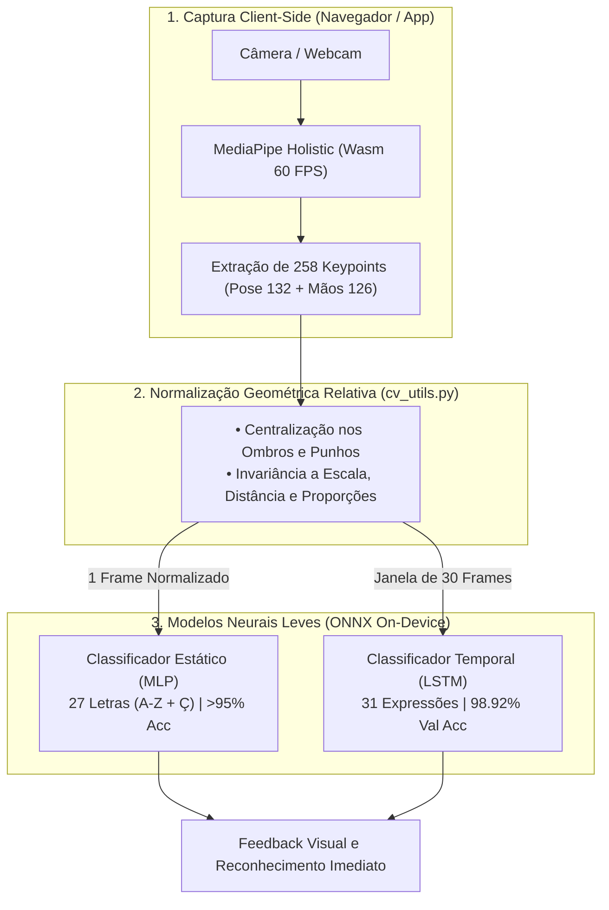
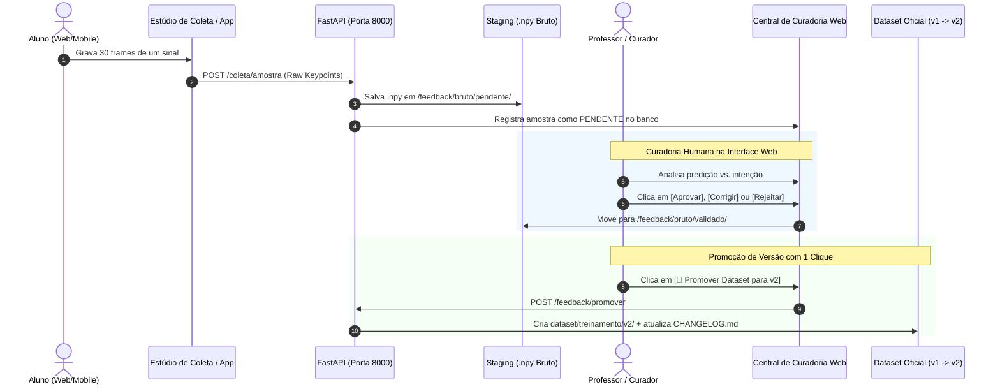

# 🧠 Sinaliza App — Apresentação da 1ª Avaliação (1ª VA)
## Arquitetura de Visão Computacional, Estúdio de Coleta Web & Continuous Learning (MLOps)
**Disciplina:** PIEC3 — Projeto Integrado de Engenharia de Computação 3  
**Data da Apresentação:** Quinta-feira, 17 de Setembro de 2026  

---

## 📌 Slide 1: Visão Geral do Projeto
* **O que é o Sinaliza App:** Uma plataforma inclusiva e gamificada estilo "Duolingo de Libras", combinando tradução e prática interativa de sinais em tempo real.
* **O Desafio Central:** Como reconhecer sinais de Libras com alta acurácia em dispositivos de baixo custo (smartphones e navegadores), sem depender de servidores caros de GPU na nuvem e permitindo que o sistema **aprenda continuamente** com o uso de professores e alunos.
* **A Solução Entregue na 1ª VA:**
  1. Pipeline de Visão Computacional leve baseada em coordenadas anatômicas (**258 keypoints** via MediaPipe Holistic).
  2. Modelos neurais especialistas de alta performance (**MLP** para 27 letras e **LSTM** para 31 expressões temporais).
  3. **Estúdio de Coleta Web (*Zero-Setup*)**: Gravação de datasets assistida direto pelo navegador.
  4. **Loop de Aprendizado Contínuo (*Continuous Learning*)**: Curadoria humana e promoção de versão de dataset com 1 clique.

---

## 🎯 Slide 2: O Problema do Reconhecimento Estático vs. Continuous Learning
O reconhecimento de sinais em Libras enfrenta grandes variações no mundo real:
1. **Variações Biomecânicas:** Tamanhos de mãos diferentes, comprimentos de braços e proporções corporais distintas.
2. **Sotaques e Regionalismos:** Velocidades, amplitudes e formas de transição próprias de cada sinalizador.
3. **Casos de Borda (*Edge Cases*):** Sinais parecidos que o modelo inicial pode confundir.

```
  Abordagem Tradicional (Frágil):
  [ Dataset de Lab ] ──► [ Treino Único ] ──► [ Modelo Fixo ] (Degrada com o tempo)

  Abordagem do Sinaliza App (Data Flywheel):
  ┌────────────────────────────────────────────────────────────────────────┐
  │  [ Estúdio Web / App ] ──► [ Erros / Coletas ] ──► [ Curadoria Web ]   │
  │          ▲                                                 │           │
  │          └─────────── [ Modelo v2 Retreinado ] ◄───────────┘           │
  └────────────────────────────────────────────────────────────────────────┘
```

---

## 🗺️ Slide 3: Arquitetura do Pipeline de Visão Computacional



---

## 🎥 Slide 4: O Novo Estúdio de Coleta Web (Data Studio)
> **Inovação de Engenharia:** Eliminação total da barreira de entrada para criação e expansão de datasets.

* **Como era antes:** O voluntário/professor precisava clonar o repositório, configurar ambiente Python (`.venv`), instalar OpenCV, compilar MediaPipe e rodar scripts no terminal.
* **Como funciona agora:**
  * Basta acessar `/dashboard/data-studio` no Google Chrome ou Edge.
  * **MediaPipe Holistic via WebAssembly:** Rastreia e desenha o esqueleto corporal a 60 FPS com zero latência.
  * **Gravação Assistida:** Contagem regressiva (3, 2, 1... Gravando!), barra de progresso dos 20/30 frames e avisos visuais de estabilidade das mãos.
  * **Atalhos Ergonômicos:** Tecla `[Espaço]` para gravar/salvar e `[R]` para descartar e regravar em 1 segundo.
  * **58 Classes Dinâmicas:** Carregadas dinamicamente via API (sem hardcoding).
  * **Cadastro de Novos Sinais:** Professores podem adicionar novos termos ao vocabulário com status `aguardando_treinamento`.
  * **Gamificação para Alunos:** Alunos ganham **+10 XP** no ranking a cada sinal colaborado.

---

## 🛡️ Slide 5: Central de Curadoria e Promoção Imutável de Datasets



---

## 📊 Slide 6: Resultados Concretos Entregues na 1ª VA

### 1. Modelo de Expressões Temporais (LSTM — 31 Classes Dinâmicas)
* **Arquitetura:** 2 Camadas LSTM ($Hidden=128$, $Dropout=0.3$) + Bloco Denso ($128 \rightarrow 128 \rightarrow 31$).
* **Dataset Base:** 930 vídeos gravados ($27.900$ frames no total).
* **Acurácia de Validação:** **`98.92%`** (Loss mínima: `0.0620`).
* **Acurácia Global no Dataset:** **`93.01%` (865 acertos em 930 amostras)**.
* **22 Classes com 100% de Precisão:** `amar`, `azul`, `boa_noite`, `branco`, `brincar_jogar`, `cavalo`, `cinza`, `coelho`, `comer`, `gato`, `gostar`, `macaco`, `preto`, `querer`, `trabalhar`, `tudo_bem`, `verde`, `vermelho`, etc.

### 2. Modelo do Alfabeto Estático (MLP — 27 Classes A-Z + Ç)
* **Acurácia:** $> 95\%$ em tempo real frame a frame.

### 3. Exportação Universal ONNX & Latência On-Device
* **Tamanho do Modelo LSTM:** **`1.37 MB`** | **Tamanho do MLP:** **`169.6 KB`**.
* **Latência de Inferência:** **$\sim 4\text{ ms}$** no navegador e mobile via WebAssembly.
* **Divergência Numérica PyTorch vs. ONNX:** $\Delta < 10^{-5}$ (Aprovado).

---

## 🤝 Slide 7: Engenharia de Software & Integração Segura
* **Arquitetura Não-Invasiva:** Integração híbrida entre o ecossistema de visão computacional e o banco de dados (PostgreSQL/Supabase + fallback SQLite), **sem alterar nenhuma tabela ou rota existente do projeto**.
* **Preservação de Dados Brutos (*RAW Data*):** Todos os `.npy` são salvos como coordenadas brutas, garantindo que o dataset nunca se torne obsoleto caso as fórmulas de normalização sejam refinadas no futuro.
* **Documentação de Transição:** Criação do guia [`INTEGRACAO_KHALIL.md`](file:///c:/Users/Notebook/Documents/Sinaliza_vision_backend/INTEGRACAO_KHALIL.md) para permitir que outros membros da equipe usufruam da esteira sem atrito.

---

## 🔬 Slide 8: Pesquisa e Próximos Passos (2ª VA)
1. **Prevenção de Esquecimento Catastrófico (*Catastrophic Forgetting*):**
   * Implementação de *Experience Replay* (mesclar 80% do dataset base `v1` com 20% das novas amostras validadas `v2` durante o retreino).
2. **Gatilhos Automáticos de Retreino (*Triggered Automated Retraining*):**
   * Disparo de retreino baseado em volume acumulado de curadoria ou degradação de confiança.
3. **Detecção de *Concept Drift* / *Data Drift*:**
   * Monitoramento de desvio estatístico de sinalizadores para calibração adaptativa.
4. **Execução On-Device Nativa no Flutter Mobile:**
   * Integração dos modelos `.onnx` no app mobile para prática 100% offline.

---

## 🎬 Roteiro Sugerido para a Demonstração ao Professor (Quinta-feira)

Para encantar o professor durante a apresentação prática, siga este roteiro de 3 minutos:

1. **Passo 1: Estúdio de Coleta Web (`/dashboard/data-studio`)**
   * Abra o painel no navegador, ative a câmera e mostre o esqueleto do MediaPipe Holistic desenhando em tempo real a 60 FPS.
   * Selecione um sinal (ex: `bom_dia`), aperte `[Espaço]`, aguarde a contagem (3, 2, 1) e execute o movimento enquanto a barra de progresso enche.
   * Mostre o aviso de confirmação e a adição de **+10 XP**.
2. **Passo 2: Central de Curadoria (`/dashboard/curator`)**
   * Abra a lista de amostras pendentes, mostre a gravação recém-enviada e clique em **"Aprovar"**.
   * Mostre o botão **"🚀 Promover Dataset"** explicando como as amostras aprovadas migram para a versão `v2` de treinamento.
3. **Passo 3: Laboratório de IA (`/dashboard/ai-lab`)**
   * Abra a tela de teste de IA com ONNX Web e execute um sinal na câmera para mostrar a inferência rodando em **~4 ms** direto no navegador!
